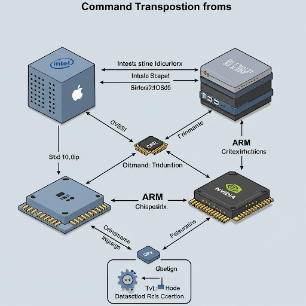

# PlayAndStoreApp - Tchip
Run Android Apps on iPhone and iPhone Apps on Android

## All we have to do is create a transposition layer chip on all types of hardware to translate the chipset commands.
We can start by mocking the transposition chip in software.

